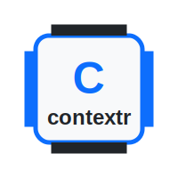

# contextr



A powerful tool for collecting and packaging code files for LLM context.

## Overview

contextr is a TypeScript library that helps you build context for Large Language Models (LLMs) by collecting and packaging code files from your project. It provides a flexible and powerful way to include specific files, directories, and patterns in your context, with advanced features for security, visualization, and customization.

## Features

- **File Collection**: Include specific files, directories, or glob patterns
- **Regex Pattern Matching**: Use regular expressions for more powerful file matching
- **Whitelist/Blacklist**: Precisely control which files are included or excluded
- **In-file Search**: Search for specific content within files
- **Tree View**: Display the full project tree structure
- **List-only Mode**: Include files in the tree without their contents
- **Security Features**:
  - GitIgnore Integration: Automatically exclude files matched by .gitignore
  - Sensitive Data Detection: Identify potential API keys, passwords, and other sensitive information
  - Special handling for env files: Option to include only keys without values
- **Plugin System**:
  - Security Scanners: Detect and report security issues
  - Output Renderers: Format context in different ways (Console, JSON, Markdown, HTML)
  - LLM Reviewers: Use local LLMs to review and summarize code
- **CLI Interface**: Powerful command-line interface with comprehensive options
- **UI Studio Mode**: Visual interface for building context and managing files

## Installation

```bash
npm install contextr
```

## Basic Usage

```typescript
import { FileContextBuilder } from 'contextr';

// Create a context builder
const builder = new FileContextBuilder({
  includeDirs: ['src'],
  exclude: ['**/*.test.ts', 'node_modules/**'],
  includeFiles: ['package.json', 'README.md']
});

// Build context
const result = await builder.build('console');
console.log(result.output);
```

## Advanced Usage

### Using Regex Pattern Matching

```typescript
import { FileContextBuilder } from 'contextr';

const builder = new FileContextBuilder({
  includeDirs: ['src'],
  exclude: [/node_modules/, /\.test\.ts$/],
  useRegex: true
});

const result = await builder.build('console');
```

### Using Whitelist/Blacklist

```typescript
import { FileContextBuilder, WhitelistBlacklist } from 'contextr';

// Create whitelist/blacklist configuration
const fileFilter = WhitelistBlacklist.create({
  whitelist: ['src/**/*.ts', 'config/*.json'],
  blacklist: ['**/*.test.ts', '**/node_modules/**']
});

// Use with context builder
const builder = new FileContextBuilder({
  fileFilter
});

const result = await builder.build('console');
```

### Searching Within Files

```typescript
import { FileContextBuilder, FileContentSearch } from 'contextr';

// Search for specific content
const searchResults = await FileContentSearch.searchInFiles({
  patterns: ['TODO', /fixme/i],
  directories: ['src'],
  useRegex: true,
  caseSensitive: false
});

console.log(searchResults);

// Build context with only files containing matches
const builder = new FileContextBuilder({
  includeFiles: searchResults.map(result => result.filePath)
});

const result = await builder.build('console');
```

### Using Tree View

```typescript
import { generateTree, formatTree } from 'contextr';

// Generate tree
const tree = await generateTree({
  rootDir: process.cwd(),
  exclude: ['node_modules/**', '.git/**'],
  listOnlyPatterns: ['**/*.png', '**/*.jpg']
});

// Format and display tree
console.log(formatTree(tree, { showSize: true, showListOnly: true }));
```

### Using List-only Mode

```typescript
import { FileContextBuilder } from 'contextr';

const builder = new FileContextBuilder({
  includeDirs: ['src'],
  // Files to include in the tree but not their contents
  listOnlyFiles: ['public/images/logo.png'],
  listOnlyPatterns: ['**/*.png', '**/*.jpg']
});

const result = await builder.build('console');
```

### Using Security Features

```typescript
import { PluginEnabledFileContextBuilder } from 'contextr';

const builder = new PluginEnabledFileContextBuilder({
  includeDirs: ['src'],
  plugins: {
    securityScanners: [
      'gitignore-security-scanner',
      'sensitive-data-security-scanner'
    ],
    securityScannerConfig: {
      'gitignore-security-scanner': {
        treatGitIgnoreAsSecurityIssue: true
      },
      'sensitive-data-security-scanner': {
        envFilesKeysOnly: true
      }
    }
  }
});

const result = await builder.build('console');
```

### Using Output Renderers

```typescript
import { PluginEnabledFileContextBuilder } from 'contextr';

const builder = new PluginEnabledFileContextBuilder({
  includeDirs: ['src'],
  plugins: {
    outputRenderers: [
      'markdown-renderer',
      'html-renderer'
    ],
    outputRendererConfig: {
      'markdown-renderer': {
        includeTableOfContents: true,
        includeSecurityWarnings: true
      }
    }
  }
});

// Build context with Markdown format
const result = await builder.build('markdown');
```

### Using LLM Reviewers

```typescript
import { PluginEnabledFileContextBuilder } from 'contextr';

const builder = new PluginEnabledFileContextBuilder({
  includeDirs: ['src'],
  plugins: {
    llmReviewers: [
      'local-llm-reviewer'
    ],
    llmReviewerConfig: {
      'local-llm-reviewer': {
        generateFileSummaries: true,
        generateProjectSummary: true
      }
    }
  }
});

const result = await builder.build('console');
```

## CLI Usage

contextr provides a powerful CLI for building context from the command line.

### Basic Commands

```bash
# Show help
npx contextr --help

# Build context from a directory
npx contextr build --dir src --output context.txt

# Show file tree
npx contextr tree show --dir src

# Build context from tree
npx contextr tree build --dir src --output context.txt

# Search in files
npx contextr search "TODO" --dir src

# Launch UI studio mode
npx contextr studio
```

### Advanced CLI Options

```bash
# Build context with security scanning
npx contextr build --dir src --enable-plugins --security-scanners gitignore-security-scanner,sensitive-data-security-scanner

# Build context with custom output format
npx contextr build --dir src --format markdown --output context.md

# Build context with list-only files
npx contextr build --dir src --list-only "**/*.png,**/*.jpg"

# Show tree with specific options
npx contextr tree show --dir src --include-hidden --max-depth 3 --exclude "node_modules/**,dist/**"
```

## UI Studio Mode

contextr includes a visual UI for building context and managing files. Launch it with:

```bash
npx contextr studio
```


The UI provides:
- File tree navigation
- Visual configuration management
- Directory configuration with drag-and-drop
- Search functionality with result highlighting
- Context preview in multiple formats

## Plugin System

contextr has a flexible plugin system that allows extending its functionality.

### Plugin Types

- **Security Scanners**: Detect and report security issues
- **Output Renderers**: Format context in different ways
- **LLM Reviewers**: Use LLMs to review and summarize code

### Built-in Plugins

#### Security Scanners
- **GitIgnore Security Scanner**: Uses .gitignore patterns to identify potentially sensitive files
- **Sensitive Data Security Scanner**: Detects API keys, passwords, and other sensitive information

#### Output Renderers
- **Console Renderer**: Formats context for terminal output
- **JSON Renderer**: Outputs context as structured JSON
- **Markdown Renderer**: Creates Markdown documentation with syntax highlighting
- **HTML Renderer**: Generates interactive HTML with collapsible sections

#### LLM Reviewers
- **Local LLM Reviewer**: Uses locally installed LLMs (Ollama, LLama.cpp, GPT4All) for code review

### Creating Custom Plugins

Plugins are stored in a designated plugins directory and loaded automatically. See the [Plugin Development Guide](./docs/plugin-development.md) for details on creating custom plugins.

## Architecture

contextr is built with a modular architecture that separates concerns and allows for flexible extension.


## Examples

See the [examples](./examples) directory for complete usage examples:

- [Plugin System Example](./examples/plugin-system-example.js)
- [Tree and List-only Example](./examples/tree-and-list-only-example.js)
- [Security Features Example](./examples/security-features-example.js)
- [CommonJS Example](./examples/commonjs-example.js)
- [ES Module Example](./examples/esm-example.js)
- [CLI Example](./examples/cli-example.js)

## Module Compatibility

contextr supports both CommonJS and ES modules:

```javascript
// CommonJS
const { FileContextBuilder } = require('contextr');

// ES Modules
import { FileContextBuilder } from 'contextr';
```

## VSCode Extension

A VSCode extension concept is available in the [docs/vscode-extension-concept.md](./docs/vscode-extension-concept.md) file, which outlines how contextr could be integrated directly into VSCode.

## License

MIT
